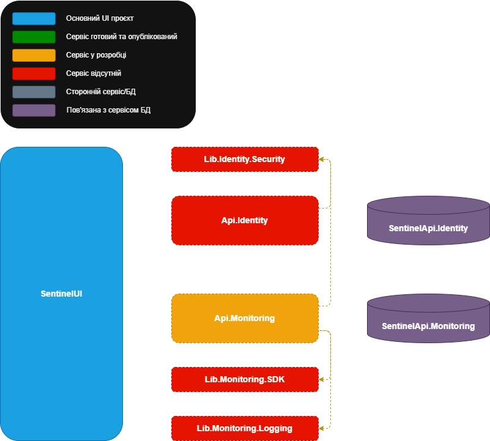

# Sentinel System

Система для централізованого моніторингу статусу сервісів та збору логів.

## 📚 Documentation

| Document | Description |
| --- | --- |
| `/docs/SentinelSchemes.drawio` | Файл схеми проекту |
| [Project Contributing](docs/CONTRIBUTING.md) | Правила стилю комітів |

---

## 🧱 Architecture



---

## 📁 Project structure

```
├── SentinelApi.Identity/
├── SentinelApi.Monitoring/
├── SentinelLib.Identity.Security/
├── SentinelLib.Monitoring.SDK/
├── SentinelLib.Monitoring.Logging.NLog/
├── SentinelUI/
├── docs/
├── .gitignore
├── README.md
```

---

## 📚 Services Documentation

| Service | Description | Documentation |
| --- | --- | --- |
| **SentinelApi.Identity** | *Аутентифікація користувачів* | [README](SentinelApi.Identity/README.md) |
| **SentinelApi.Monitoring** | *Конфігурація та запуск перевірок, збирання логів* | [README](SentinelApi.Monitoring/README.md) |
| **SentinelLib.Identity.Security** | *Бібліотека верифікації токена авторизації* | [README](SentinelLib.Identity.Security/README.md) |
| **SentinelLib.Monitoring.SDK** | *Бібліотека SDK для моніторингу* | [README](SentinelLib.Monitoring.SDK/README.md) |
| **SentinelLib.Monitoring.Logging.NLog** | *Бібліотека логування для моніторингу* | [README](SentinelLib.Monitoring.Logging.NLog/README.md) |
| **SentinelUI** | *Клієнтський інтерфейс для взаємодії користувача з системою* | [README](SentinelUI/README.md) |
